# 🚛 CargoFlow — Modern Road Freight & Fleet Management Platform

> **Enterprise-grade logistics & fleet telematics platform** built with a cloud-native, containerized microservices architecture — deployed to **Azure Kubernetes Service (AKS)** via a fully automated CI/CD pipeline using **Jenkins** (CI) and **Azure DevOps** (CD).

[](https://nodejs.org/)
[](https://react.dev/)
[](https://docker.com/)
[](https://azure.microsoft.com/en-us/products/kubernetes-service)
[](https://www.jenkins.io/)
[](https://dev.azure.com/)
[](https://prometheus.io/)
[](https://grafana.com/)

---

## 📋 Table of Contents

- [What is CargoFlow?](#-what-is-cargoflow)
- [Application Architecture](#️-application-architecture)
- [CI/CD Pipeline Architecture](#-cicd-pipeline-architecture)
- [Tech Stack](#-tech-stack)
- [Docker Image Optimization](#-docker-image-optimization)
- [Kubernetes Manifests on AKS](#️-kubernetes-manifests-on-aks)
- [Azure Key Vault — Secrets Management](#-azure-key-vault--secrets-management)
- [Monitoring: Prometheus & Grafana](#-monitoring-prometheus--grafana)
- [Local Development Setup](#-local-development-setup)
- [Environment Variables](#️-environment-variables)
- [User Roles & Workflow](#-user-roles--workflow)

---

## 🚛 What is CargoFlow?

CargoFlow digitizes the **entire road freight lifecycle** — from a customer booking a shipment, to a fleet owner dispatching a truck, to real-time GPS tracking, all the way to GST-compliant invoice delivery.

| Role | What They Can Do |
|:---|:---|
| **Customer (Shipper)** | Book freight, get live quotations, track cargo on interactive maps, download GST invoices |
| **Fleet Owner** | Manage trucks & drivers, issue quotations, dispatch loads, view earnings & analytics |
| **Public** | Track any shipment via a public URL — no login required |

The platform runs as **3 independently deployable containerized services:**

```
📦 cargoflow/
├── 🖥️  backend/           →  Node.js + Express REST API + Socket.IO  (Port 5000)
├── 🌐  customer-portal/   →  React + Vite Customer Web App           (Port 3000)
└── 🏢  owner-portal/      →  React + Vite Fleet Owner Web App        (Port 3001)
```

---

## 🏗️ Application Architecture

```
                    ┌──────────────────────────────────────────────────────────┐
                    │               AZURE KUBERNETES SERVICE (AKS)             │
                    │                                                          │
  ┌─────────────┐  │  ┌─────────────────┐      ┌────────────────────────┐      │
  │  Customer   │──┼─►│ customer-portal  │      │     owner-portal      │      │
  │  (Browser)  │  │  │ Deployment × 2  │      │   Deployment × 2       │      │
  └─────────────┘  │  │ Port: 3000      │      │   Port: 3001           │      │
                   │  │ HPA: 1–10 pods  │      │   HPA: 1–10 pods       │      │
  ┌─────────────┐  │  └────────┬────────┘      └──────────┬─────────────┘      │
  │ Fleet Owner │──┼─►         │                           │                   │
  │  (Browser)  │  │           └────────────┬──────────────┘                   │
  └─────────────┘  │                        │  REST API + WebSocket (5000)     │
                   │                        ▼                                  │
                   │           ┌────────────────────────┐                      │
                   │           │    cargoflow-backend   │                      │
                   │           │    Deployment × 2      │                      │
                   │           │    Port: 5000          │                      │
                   │           │    HPA: 1–10 pods      │                      │
                   │           │    /api/health ✅      │                      │
                   │           └────────────┬───────────┘                      │
                   └────────────────────────┼──────────────────────────────────┘
                                            │
              ┌─────────────────────────────┼──────────────────────────────────┐
              │              EXTERNAL MANAGED SERVICES                         │
              │                             │                                  │
              │  ┌──────────────┐    ┌──────┴─────────┐     ┌────────────────┐ │
              │  │ MongoDB Atlas│◄───│  Backend API    │───►│  Upstash Redis │ │
              │  │  (Primary DB)│    │  (BullMQ Jobs + │    │  (Cache +      │ │
              │  └──────────────┘    │   Socket.IO)    │    │   BullMQ Queue)│ │
              │                      └────────────────-┘    └────────────────┘ │
              │  ┌──────────────┐    ┌─────────────────┐                       │
              │  │  Azure Key   │    │  OSRM/Nominatim │                       │
              │  │  Vault       │    │  (Geocoding &   │                       │
              │  │  (Secrets)   │    │   Routing API)  │                       │
              │  └──────────────┘    └─────────────────┘                       │
              └────────────────────────────────────────────────────────────────┘
```

### Project Folder Structure

```
cargoflow/
├── backend/
│   ├── src/
│   │   ├── config/          # MongoDB, Redis/Upstash & Zod env-schema validation
│   │   ├── controllers/     # Auth, Fleet, Shipment, Request, Invoice controllers
│   │   ├── middleware/      # JWT auth, RBAC, error handling, rate limiting
│   │   ├── models/          # Mongoose models (User, Truck, Driver, Shipment…)
│   │   ├── queues/          # BullMQ queues & workers (Email + PDF generation)
│   │   ├── routes/          # Express API route endpoints
│   │   ├── services/        # Auth, Email, Geo/Distance, State Machine services
│   │   ├── socket/          # Socket.IO rooms & real-time GPS milestone events
│   │   └── utils/           # ApiResponse, ApiError helpers, constants
│   ├── tests/               # Jest + Supertest integration test suite
│   ├── k8s/                 # Kubernetes manifests (deployment, service, hpa, configmap)
│   ├── Dockerfile           # Multi-stage optimized image (~54 MB)
│   └── index.js             # Server bootstrap & graceful process lifecycle
├── customer-portal/
│   ├── src/
│   │   ├── components/      # Layout, Leaflet RouteMap, reusable UI
│   │   ├── pages/           # Landing, Auth, Dashboard, Tracking, Payments
│   │   ├── services/        # Axios client, Socket.IO subscriber, Geo API
│   │   └── store/           # Zustand auth & toast notification stores
│   ├── k8s/                 # Kubernetes manifests
│   └── Dockerfile           # Multi-stage build → static serve (~54 MB)
└── owner-portal/
    ├── src/
    │   ├── components/      # Layout, RouteMap, Modals, UI
    │   ├── pages/           # Auth, Dashboard, Trucks, Drivers, Reports
    │   ├── services/        # Axios client & Socket.IO emitter
    │   └── store/           # Zustand auth & toast stores
    ├── k8s/                 # Kubernetes manifests
    └── Dockerfile           # Multi-stage build → static serve (~54 MB)
```

---

## 🔄 CI/CD Pipeline Architecture

> **Jenkins handles CI** (build → test → dockerize → push to ACR).
> **Azure DevOps handles CD** (pull secrets from Key Vault → deploy to AKS → verify rollout).

```mermaid
flowchart TD
    DEV["👨‍💻 Developer\nLocal Machine"]

    subgraph SOURCE["📁 Source Control"]
        GIT["Git\nLocal Commit"]
        GITHUB["GitHub\nRemote Repository\n(branch protection + PR rules)"]
    end

    subgraph CI["⚙️ Jenkins — Continuous Integration"]
        direction TB
        J1["🔍 Stage 1: Checkout\nPull latest code from GitHub"]
        J2["📦 Stage 2: Install Dependencies\nnpm ci — all 3 services"]
        J3["🧪 Stage 3: Run Tests\nJest + Supertest integration suite"]
        J4["🐳 Stage 4: Docker Build\nMulti-stage Dockerfiles\n203 MB → 54 MB per image"]
        J5["📤 Stage 5: Push to ACR\nAzure Container Registry\nTagged: git-sha + latest"]
        J1 --> J2 --> J3 --> J4 --> J5
    end

    subgraph CD["🚀 Azure DevOps — Continuous Deployment"]
        direction TB
        AD1["🔔 Release Triggered\nOn new ACR image push event"]
        AD2["🔑 Azure Key Vault Task\nFetch all secrets at deploy-time\n(MongoDB URI, Redis token, JWT keys)"]
        AD3["🛡️ Approval Gate\nOptional: manual sign-off\nfor production environment"]
        AD4["☁️ Azure CLI\naz aks get-credentials\n(authenticate to cluster)"]
        AD5["📋 kubectl apply -k\nKustomize overlays\nbackend + portals"]
        AD6["🔄 Rolling Update\nZero-downtime rollout\nmaxUnavailable: 0"]
        AD1 --> AD2 --> AD3 --> AD4 --> AD5 --> AD6
    end

    subgraph AKS["☸️ Azure Kubernetes Service (AKS)"]
        direction LR
        P1["customer-portal\nDeployment × 2\nHPA: 1–10 pods"]
        P2["owner-portal\nDeployment × 2\nHPA: 1–10 pods"]
        P3["cargoflow-backend\nDeployment × 2\nHPA: 1–10 pods"]
        P1 & P2 --> P3
    end

    subgraph MON["📊 Observability Stack"]
        PROM["Prometheus\nScrapes /metrics every 15s\nCPU · Memory · HTTP latency"]
        GRAF["Grafana\nDashboards + Alert Rules\nPagerDuty / Email on breach"]
        PROM --> GRAF
    end

    DEV -->|"git commit + push"| GIT
    GIT -->|"git push origin"| GITHUB
    GITHUB -->|"Webhook triggers pipeline"| CI
    CI -->|"Images tagged & pushed"| CD
    CD -->|"kubectl apply -k"| AKS
    AKS -->|"Metrics scraped"| MON
```



## 💻 Tech Stack

### Backend
| Layer | Technology | Purpose |
|:------|:-----------|:--------|
| Runtime | Node.js 20 LTS | Server-side JavaScript runtime |
| Framework | Express.js | RESTful routing, CORS, cookie parsing |
| Database | MongoDB Atlas + Mongoose | Primary data store; schema modeling, aggregation pipelines |
| Cache & Queue | Upstash Redis + BullMQ | Distributed caching, rate limiting, async email/PDF jobs |
| Real-Time | Socket.IO | Bi-directional GPS telemetry & shipment status push |
| Auth | JWT (Access + Refresh) + BcryptJS | Stateless auth with httpOnly cookies |
| Validation | Zod | Strict runtime schema validation on all API inputs |
| Email | Nodemailer + Gmail SMTP | Transactional emails (confirmations, invoices) |

### Frontend (Both Portals)
| Layer | Technology | Purpose |
|:------|:-----------|:--------|
| Core | React 18 + Vite 5 | Lightning-fast HMR and optimized production bundler |
| State | Zustand | Lightweight persistent auth & UI state |
| Routing | React Router 6 | Protected routes, history navigation |
| HTTP | Axios | JWT interceptors for automatic token refresh |
| Maps | Leaflet + React-Leaflet | Interactive highway routes & GPS truck beacons |
| Geocoding | OSRM + Nominatim + Open-Meteo | 100% free dynamic road routing & distance |

### Infrastructure & DevOps
| Tool | Role |
|:-----|:-----|
| **Docker** (multi-stage) | Optimized container images — ~54 MB each |
| **Azure Kubernetes Service** | Container orchestration, auto-scaling, rolling updates |
| **Jenkins** | CI: checkout → install → test → build Docker → push to ACR |
| **Azure DevOps** | CD: release pipelines, environments, manual approval gates |
| **Azure Container Registry** | Private Docker image registry |
| **Azure Key Vault** | Centralized secrets management (zero secrets in code) |
| **Kustomize** | Kubernetes manifest overlay & secret generation |
| **Prometheus** | Pod metrics collection from AKS |
| **Grafana** | Dashboards, alert rules, and on-call notifications |
| **Azure CLI** | AKS cluster authentication & resource management |

---

## 🐳 Docker Image Optimization

### Result: **203 MB → 54 MB** (73% reduction per image)

| Optimization Technique | Before | After |
|:-----------------------|:-------|:------|
| Base image | `node:20` (full Debian ~350 MB) | `node:20-alpine` (~50 MB) |
| Build strategy | Single-stage | Multi-stage (build artifacts only copied) |
| Dependency install | `npm install` (all deps) | `npm ci --omit=dev` (prod-only, exact lockfile) |
| Cache layers | No cleanup | `&& npm cache clean --force` in same RUN layer |
| Source code in image | Full source + devDeps | Production source only — no tests, no tooling |
| Process user | `root` | Non-root `node` user (UID 1000) — security hardened |

---

## ☸️ Kubernetes Manifests on AKS

Each service owns its `k8s/` folder with a complete set of manifests:

```
backend/k8s/
├── deployment.yaml      # 2 replicas, RollingUpdate, liveness + readiness probes
├── service.yaml         # ClusterIP on port 5000
├── hpa.yaml             # Auto-scale 1→10 pods (85% CPU / 80% Memory)
├── configmap.yaml       # Non-sensitive config (NODE_ENV, URLs, port)
└── kustomization.yaml   # secretGenerator + commonLabels

customer-portal/k8s/
├── deployment.yaml      # 2 replicas, probes on /  (port 3000)
├── service.yaml         # ClusterIP on port 3000
├── hpa.yaml             # Auto-scale 1→10 pods
└── kustomization.yaml

owner-portal/k8s/
├── deployment.yaml      # 2 replicas, probes on /  (port 3001)
├── service.yaml         # ClusterIP on port 3001
├── hpa.yaml             # Auto-scale 1→10 pods
└── kustomization.yaml
```

### Key Kubernetes Features

| Feature | Configuration |
|:--------|:-------------|
| **Rolling Updates** | `maxSurge: 1`, `maxUnavailable: 0` — zero downtime on every deploy |
| **Health Probes** | Liveness + Readiness on `/api/health` (backend) and `/` (portals) |
| **Auto-Scaling (HPA)** | Scales pods 1→10 when CPU > 85% or Memory > 80% |
| **Resource Limits** | Backend: 100m–500m CPU, 128Mi–512Mi RAM · Portals: 50m–250m CPU, 64Mi–256Mi RAM |
| **Secrets** | Injected via Kustomize `secretGenerator` sourced from Azure Key Vault |

### Deploy to AKS

```bash
# 1. Authenticate with Azure and get AKS credentials
az login
az aks get-credentials --resource-group cargoflow-rg --name cargoflow-aks

# 2. Apply all manifests via Kustomize (secrets auto-generated from .env.secrets)
kubectl apply -k backend/k8s/
kubectl apply -k customer-portal/k8s/
kubectl apply -k owner-portal/k8s/

# 3. Verify the rollout
kubectl rollout status deployment/cargoflow-backend
kubectl get pods -l app.kubernetes.io/part-of=cargoflow
kubectl get hpa
```

---

## 🔐 Azure Key Vault — Secrets Management

All sensitive credentials (MongoDB URI, Upstash Redis token, JWT secrets, Gmail password) are stored exclusively in **Azure Key Vault**. They are fetched at deploy-time by Azure DevOps and injected into Kubernetes Secrets. **Zero secrets live in source code or container images.**

### Secret Inventory

| Key Vault Secret Name | Kubernetes Env Var | Used By |
|:----------------------|:-------------------|:--------|
| `cargoflow-mongodb-uri` | `MONGODB_URI` | Backend → MongoDB Atlas |
| `cargoflow-jwt-access-secret` | `JWT_ACCESS_SECRET` | Backend → JWT signing |
| `cargoflow-jwt-refresh-secret` | `JWT_REFRESH_SECRET` | Backend → JWT refresh |
| `cargoflow-upstash-redis-url` | `UPSTASH_REDIS_REST_URL` | Backend → Redis cache + BullMQ |
| `cargoflow-upstash-redis-token` | `UPSTASH_REDIS_REST_TOKEN` | Backend → Redis auth |
| `cargoflow-gmail-user` | `GMAIL_USER` | Backend → Nodemailer SMTP |
| `cargoflow-gmail-password` | `GMAIL_APP_PASSWORD` | Backend → Nodemailer SMTP |

### How Secrets Flow: Key Vault → AKS Pods

```
┌─────────────────────────────────────────────────────────────────┐
│                     Azure Key Vault                             │
│   cargoflow-mongodb-uri      = mongodb+srv://...                │
│   cargoflow-upstash-redis-*  = https://...upstash.io / token    │
│   cargoflow-jwt-*            = <cryptographically random>       │
└──────────────────────┬──────────────────────────────────────────┘
                       │  AzureKeyVault@2 task (Azure DevOps pipeline)
                       ▼
┌─────────────────────────────────────────────────────────────────┐
│              Azure DevOps Release Pipeline                      │
│                                                                 │
│  - task: AzureKeyVault@2                                        │
│    inputs:                                                      │
│      KeyVaultName: 'cargoflow-keyvault'                         │
│      SecretsFilter: '*'                                         │
│      RunAsPreJob: true                                          │
│                                                                 │
│  Secrets become pipeline variables, then pushed to K8s via:     │
│  kubectl create secret generic backend-secrets \                │
│    --from-literal=MONGODB_URI=$(cargoflow-mongodb-uri) \        │
│    --from-literal=UPSTASH_REDIS_REST_URL=$(...)  \              │
│    --dry-run=client -o yaml | kubectl apply -f -                │
└──────────────────────┬──────────────────────────────────────────┘
                       │ kubernetes Secret "backend-secrets" created/updated
                       ▼
┌─────────────────────────────────────────────────────────────────┐
│           AKS Pod — cargoflow-backend                           │
│                                                                 │
│   envFrom:                                                      │
│     - secretRef:                                                │
│         name: backend-secrets    ← all vars mounted as env vars │
└─────────────────────────────────────────────────────────────────┘
```

### One-Time Key Vault Setup (Azure CLI)

```bash
# Create the vault
az keyvault create \
  --name cargoflow-keyvault \
  --resource-group cargoflow-rg \
  --location eastus

# Store all secrets
az keyvault secret set --vault-name cargoflow-keyvault \
  --name cargoflow-mongodb-uri \
  --value "mongodb+srv://<user>:<pass>@cluster.mongodb.net/cargoflow"

az keyvault secret set --vault-name cargoflow-keyvault \
  --name cargoflow-upstash-redis-url \
  --value "https://<your-db>.upstash.io"

az keyvault secret set --vault-name cargoflow-keyvault \
  --name cargoflow-upstash-redis-token \
  --value "<your-upstash-token>"

az keyvault secret set --vault-name cargoflow-keyvault \
  --name cargoflow-jwt-access-secret \
  --value "$(openssl rand -base64 64)"

az keyvault secret set --vault-name cargoflow-keyvault \
  --name cargoflow-jwt-refresh-secret \
  --value "$(openssl rand -base64 64)"

# Grant AKS managed identity read access
AKS_IDENTITY=$(az aks show \
  --resource-group cargoflow-rg \
  --name cargoflow-aks \
  --query identityProfile.kubeletidentity.clientId -o tsv)

az keyvault set-policy \
  --name cargoflow-keyvault \
  --object-id $AKS_IDENTITY \
  --secret-permissions get list
```

---

## 📊 Monitoring: Prometheus & Grafana

CargoFlow uses **Prometheus** for metrics scraping and **Grafana** for dashboards and alerting — both deployed inside AKS via the `kube-prometheus-stack` Helm chart.

### What is Monitored

| Metric Category | Prometheus Metric | Alert Threshold |
|:----------------|:-----------------|:----------------|
| Pod CPU Usage | `container_cpu_usage_seconds_total` | > 80% for 5 min → **warning** |
| Pod Memory Usage | `container_memory_working_set_bytes` | > 85% of limit → **warning** |
| HTTP Error Rate (5xx) | `nginx_ingress_controller_requests{status=~"5.."}` | > 1% of traffic → **critical** |
| Pod Restart / Crash Loop | `kube_pod_container_status_restarts_total` | > 3 in 15 min → **critical** |
| HPA Scaling Events | `kube_horizontalpodautoscaler_status_current_replicas` | Any scale event → **info** |
| Redis Queue Depth | BullMQ active/waiting jobs | > 100 waiting → **warning** |
| Node Resource Pressure | Node CPU, memory, disk | > 90% → **critical** |

### Install the Monitoring Stack (Helm)

```bash
# Add the Prometheus community Helm chart repo
helm repo add prometheus-community https://prometheus-community.github.io/helm-charts
helm repo update

# Install kube-prometheus-stack (Prometheus + Grafana + Alertmanager)
helm install monitoring prometheus-community/kube-prometheus-stack \
  --namespace monitoring \
  --create-namespace \
  --set grafana.adminPassword="<your-secure-password>" \
  --set prometheus.prometheusSpec.retention="15d"

# Access Grafana locally via port-forward
kubectl port-forward svc/monitoring-grafana 3001:80 -n monitoring
# Open: http://localhost:3001  →  admin / <your-secure-password>
```

### Recommended Grafana Dashboard IDs

| Dashboard | ID | Shows |
|:----------|:---|:------|
| Kubernetes Cluster Overview | `6417` | Node CPU, memory, pod status |
| Kubernetes Workloads | `13770` | Per-deployment resource usage |
| Node Exporter Full | `1860` | Full host-level metrics |
| NGINX Ingress Controller | `9614` | HTTP traffic, latency, error rates |


## 💻 Local Development Setup

### Prerequisites

| Tool | Version | Notes |
|:-----|:--------|:------|
| Node.js | `v20.x` LTS | [Download](https://nodejs.org/) |
| npm | `v10.x` | Bundled with Node.js |
| Docker Desktop | Latest | For containerized local testing |
| MongoDB Atlas | Free tier | Or local MongoDB `v7+` |
| Upstash Redis | Free tier | Optional — falls back to in-memory automatically |
| Azure CLI | `v2.x` | For AKS / Key Vault operations |

### Start All 3 Services (Development)

Open **3 terminals** and run each service:

```bash
# Terminal 1 — Backend API
cd backend
npm install
npm run dev
# Running at: http://localhost:5000  |  Health: http://localhost:5000/api/health

# Terminal 2 — Customer Portal
cd customer-portal
npm install
npm run dev
# Running at: http://localhost:3000

# Terminal 3 — Fleet Owner Portal
cd owner-portal
npm install
npm run dev
# Running at: http://localhost:3001
```

### Run Tests & Seed Data

```bash
cd backend
npm test          # Jest + Supertest integration tests
npm run seed      # Seed initial trucks, drivers & users
```

### Build & Test Docker Images Locally

```bash
# Build all images (should be ~54 MB each after optimization)
docker build -t cargoflow-backend:local ./backend
docker build -t cargoflow-customer-portal:local ./customer-portal
docker build -t cargoflow-owner-portal:local ./owner-portal

# Verify sizes
docker images | grep cargoflow

# Test backend container
docker run -p 5000:5000 --env-file backend/.env cargoflow-backend:local
```

### Service Port Reference

| Service | Port | URL | Health Endpoint |
|:--------|:-----|:----|:----------------|
| Backend API | `5000` | `http://localhost:5000` | `/api/health` |
| WebSocket (Socket.IO) | `5000` | `ws://localhost:5000` | — |
| Customer Portal | `3000` | `http://localhost:3000` | `/` |
| Fleet Owner Portal | `3001` | `http://localhost:3001` | `/` |
| MongoDB Atlas | TLS | `mongodb+srv://...` | — |
| Upstash Redis | TLS | `https://*.upstash.io` | — |

---

## ⚙️ Environment Variables

> **Production:** All secrets below are stored in **Azure Key Vault** and never committed to Git. The `.env` files below are for **local development only**.

### Backend (`backend/.env`)

```env
NODE_ENV=development
PORT=5000

# MongoDB Atlas
MONGODB_URI=mongodb+srv://<username>:<password>@cluster.mongodb.net/cargoflow

# JWT Secret Keys (generate with: openssl rand -base64 64)
JWT_ACCESS_SECRET=<min-32-char-random-string>
JWT_REFRESH_SECRET=<min-32-char-random-string>
JWT_ACCESS_EXPIRES=15m
JWT_REFRESH_EXPIRES=7d

# Upstash Redis — Optional (auto-falls-back to in-memory if blank)
UPSTASH_REDIS_REST_URL=https://your-database.upstash.io
UPSTASH_REDIS_REST_TOKEN=your_upstash_rest_token

# Gmail SMTP — Optional (logs to console if blank)
GMAIL_USER=your-email@gmail.com
GMAIL_APP_PASSWORD=xxxx xxxx xxxx xxxx
```

### Customer Portal (`customer-portal/.env`)

```env
VITE_API_URL=http://localhost:5000/api
VITE_SOCKET_URL=http://localhost:5000
```

### Fleet Owner Portal (`owner-portal/.env`)

```env
VITE_API_URL=http://localhost:5000/api
VITE_SOCKET_URL=http://localhost:5000
```

---

## 👥 User Roles & Workflow

### 1. Customer (Shipper) — `http://localhost:3000`
- Request freight shipments with **live highway distance calculation** (OSRM)
- Review and accept competitive **quotations** from fleet owners
- Track cargo in **real time** on interactive Leaflet maps via Socket.IO
- Download **GST-compliant invoices** and digital proof-of-delivery (e-POD)

### 2. Fleet Owner — `http://localhost:3001`
- Register trucks (`light`, `medium`, `heavy`, `container`) and onboard drivers
- Review incoming requests and issue **itemized quotations with GST breakdown**
- Assign trucks & drivers to confirmed bookings and dispatch loads
- Push **real-time GPS telemetry** updates; view financial analytics and reports

### 3. Public Tracking — `http://localhost:3000/public/:ref`
- Anyone with a **tracking reference** (e.g. `CF-22045`) can track a shipment on the live map — **no login required**

---

## 📄 License & Security

- **License:** Proprietary / Private
- **Secrets:** 100% managed via **Azure Key Vault** — zero secrets in source code or Docker images
- **HTTPS/TLS:** Enforced across all endpoints in production via AKS Ingress + cert-manager
- **Container Security:** All pods run as non-root `node` user (UID 1000)
- **Database Security:** MongoDB Atlas IP whitelist restricted to AKS NAT gateway IPs
- **Cookie Security:** JWT tokens stored in **httpOnly, SameSite=Strict cookies** (XSS-safe)
- **Rate Limiting:** Redis-backed API rate limiting enforced at middleware layer

