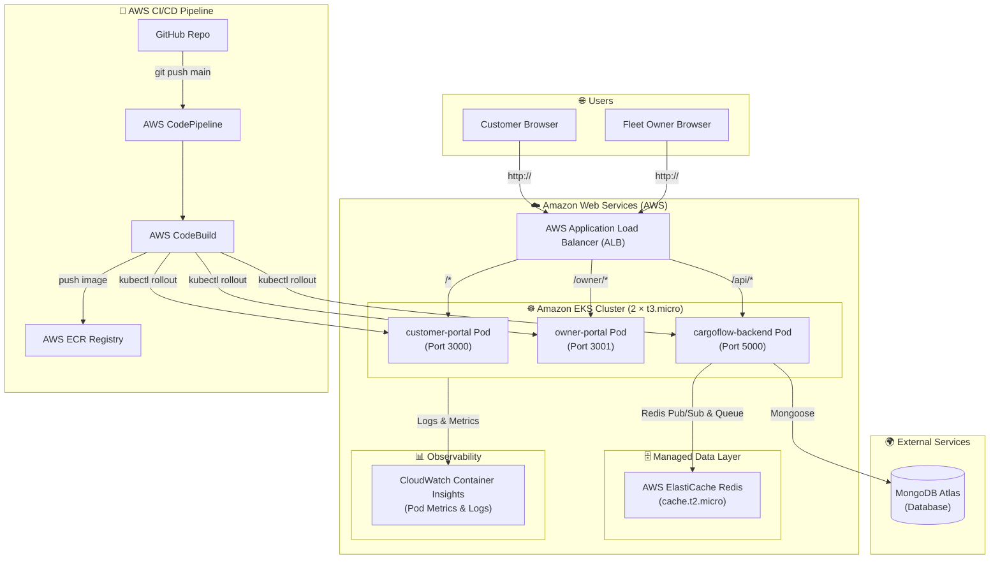

# 🚛 CargoFlow — Road Freight & Fleet Management Platform

> **Cloud-native logistics platform** built with a microservices architecture — deployed on **AWS EKS** via a fully automated CI/CD pipeline using **AWS CodeBuild + CodePipeline**.

[](https://nodejs.org/)
[](https://react.dev/)
[](https://docker.com/)
[](https://aws.amazon.com/eks/)
[](https://aws.amazon.com/codebuild/)
[](https://aws.amazon.com/cloudwatch/)

---

## What is CargoFlow?

CargoFlow digitizes the **entire road freight lifecycle** — from a customer booking a shipment, to a fleet owner dispatching a truck, to real-time GPS tracking and GST-compliant invoice delivery.

| Role | What They Can Do |
|:---|:---|
| **Customer** | Book freight, track cargo live on maps, download invoices |
| **Fleet Owner** | Manage trucks & drivers, issue quotations, view analytics |
| **Public** | Track any shipment via a public URL — no login required |

## Architecture


```mermaid
flowchart TD
    subgraph CLIENTS["🌐 Users"]
        CUST["Customer Browser"]
        OWNER["Fleet Owner Browser"]
    end

    subgraph AWS["☁️ Amazon Web Services (AWS)"]
        ALB["AWS Application Load Balancer (ALB)"]

        subgraph EKS["☸️ Amazon EKS Cluster (2 × t3.micro)"]
            direction TB
            CP["customer-portal Pod\n(Port 3000)"]
            OP["owner-portal Pod\n(Port 3001)"]
            BE["cargoflow-backend Pod\n(Port 5000)"]
        end

        subgraph DATA["🗄️ Managed Data Layer"]
            REDIS["AWS ElastiCache Redis\n(cache.t2.micro)"]
        end

        subgraph MON["📊 Observability"]
            CW["CloudWatch Container Insights\n(Pod Metrics & Logs)"]
        end
    end

    subgraph EXTERNAL["🌍 External Services"]
        MONGO[("MongoDB Atlas\n(Database)")]
    end

    subgraph CICD["🚀 AWS CI/CD Pipeline"]
        GH["GitHub Repo"] -->|"git push main"| CPIL["AWS CodePipeline"]
        CPIL --> CB["AWS CodeBuild"]
        CB -->|"push image"| ECR["AWS ECR Registry"]
        CB -->|"kubectl rollout"| BE & CP & OP
    end

    CUST -->|"http://"| ALB
    OWNER -->|"http://"| ALB
    ALB -->|"/*"| CP
    ALB -->|"/owner/*"| OP
    ALB -->|"/api/*"| BE

    BE -->|"Mongoose"| MONGO
    BE -->|"Redis Pub/Sub & Queue"| REDIS
    EKS -->|"Logs & Metrics"| CW
```

---

## Tech Stack

### Backend
| Layer | Technology |
|:------|:-----------|
| Runtime | Node.js 20 LTS |
| Framework | Express.js |
| Database | MongoDB Atlas + Mongoose |
| Cache & Queue | ElastiCache Redis + BullMQ |
| Real-Time | Socket.IO |
| Auth | JWT (Access + Refresh) + BcryptJS |
| Email | Nodemailer + Gmail SMTP |

### Frontend (Both Portals)
| Layer | Technology |
|:------|:-----------|
| Core | React 18 + Vite 5 |
| State | Zustand |
| Maps | Leaflet + React-Leaflet |
| Geocoding | OSRM + Nominatim |

### Infrastructure & DevOps
| Tool | Role |
|:-----|:-----|
| **AWS EKS** | Kubernetes cluster (2 × t3.micro) |
| **AWS ECR** | Private Docker image registry |
| **AWS CodeBuild** | CI — build & push Docker images |
| **AWS CodePipeline** | CD — GitHub → build → deploy to EKS |
| **AWS ElastiCache** | Managed Redis (free-tier eligible) |
| **CloudWatch** | Monitoring dashboards & logs |
| **Terraform** | Infrastructure as Code |
| **Docker** (multi-stage) | Optimized container images (~54 MB each) |
| **Kustomize** | Kubernetes manifest management |

---

## CI/CD Pipeline

```
GitHub push (main branch)
    │
    ▼
CodePipeline triggered automatically
    │
    ├── Stage 1: Source  — pull code from GitHub
    ├── Stage 2: Build   — CodeBuild runs buildspec.yml
    │     ├── docker build (backend, customer-portal, owner-portal)
    │     ├── docker push → ECR (tagged with git commit hash)
    │     └── kubectl set image → EKS rolling update
    └── Done — zero downtime deploy ✅
```

---

## Kubernetes Setup

Each service has its own `k8s/` folder:

```
backend/k8s/
├── deployment.yaml    # 2 replicas, liveness + readiness probes
├── service.yaml       # ClusterIP :5000
├── hpa.yaml           # Auto-scale 1→10 pods (85% CPU / 80% Memory)
├── configmap.yaml     # Non-secret config
└── kustomization.yaml

customer-portal/k8s/  # same structure, port 3000
owner-portal/k8s/     # same structure, port 3001
```

---

## Local Development

### Prerequisites
- Node.js `v20.x`
- Docker Desktop
- MongoDB Atlas (free tier)

### Start All Services

```bash
# Terminal 1 — Backend
cd backend && npm install && npm run dev
# → http://localhost:5000  |  health: /api/health

# Terminal 2 — Customer Portal
cd customer-portal && npm install && npm run dev
# → http://localhost:3000

# Terminal 3 — Owner Portal
cd owner-portal && npm install && npm run dev
# → http://localhost:3001
```

### Tests & Seed

```bash
cd backend
npm test       # Jest + Supertest integration tests
npm run seed   # Seed demo trucks, drivers & users
```

---

## Environment Variables

Copy `.env.example` to `.env` in each folder and fill in:

```env
# backend/.env
NODE_ENV=development
PORT=5000
MONGODB_URI=mongodb+srv://<user>:<pass>@cluster.mongodb.net/cargoflow
JWT_ACCESS_SECRET=<random-64-char-string>
JWT_REFRESH_SECRET=<random-64-char-string>
JWT_ACCESS_EXPIRES=15m
JWT_REFRESH_EXPIRES=7d
UPSTASH_REDIS_REST_URL=redis://<elasticache-host>:6379
GMAIL_USER=your@gmail.com
GMAIL_APP_PASSWORD=xxxx xxxx xxxx xxxx

# customer-portal/.env  &  owner-portal/.env
VITE_API_URL=http://localhost:5000/api
VITE_SOCKET_URL=http://localhost:5000
```

---

## Deploy to AWS (Terraform)

```bash
cd terraform
cp terraform.tfvars.example terraform.tfvars
# fill in your secrets in terraform.tfvars

terraform init
terraform apply   # ~15 mins — creates EKS, ECR, Redis, CodePipeline

# Connect kubectl
aws eks update-kubeconfig --region us-east-1 --name cargoflow-eks

# Apply k8s manifests
kubectl apply -k backend/k8s/
kubectl apply -k customer-portal/k8s/
kubectl apply -k owner-portal/k8s/

# View monitoring
# AWS Console → CloudWatch → Container Insights → EKS → cargoflow-eks

# IMPORTANT: Destroy after use to stop charges
terraform destroy
```

---

## User Roles

### Customer — `localhost:3000`
- Book freight with live highway distance (OSRM)
- Accept quotations from fleet owners
- Track cargo in real time on interactive maps
- Download GST-compliant invoices

### Fleet Owner — `localhost:3001`
- Register trucks and onboard drivers
- Issue itemized quotations with GST breakdown
- Dispatch loads and push GPS telemetry
- View financial analytics and reports

### Public Tracking — `localhost:3000/public/:ref`
- Anyone with a tracking reference can track a shipment — **no login required**

---

## Security
- All secrets stored in Kubernetes Secrets (created by Terraform from `terraform.tfvars`)  
- Pods run as non-root `node` user (UID 1000)  
- JWT tokens in httpOnly, SameSite=Strict cookies (XSS-safe)  
- Redis-backed API rate limiting at middleware layer  
- MongoDB Atlas IP whitelisted to EKS NAT Gateway only  
